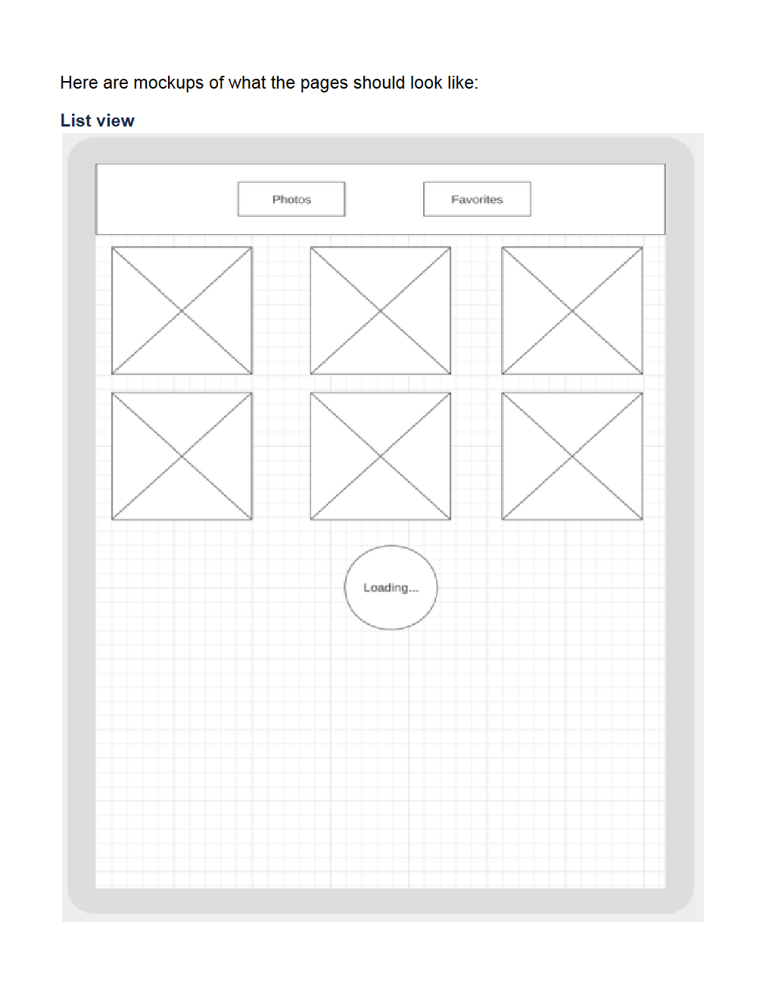
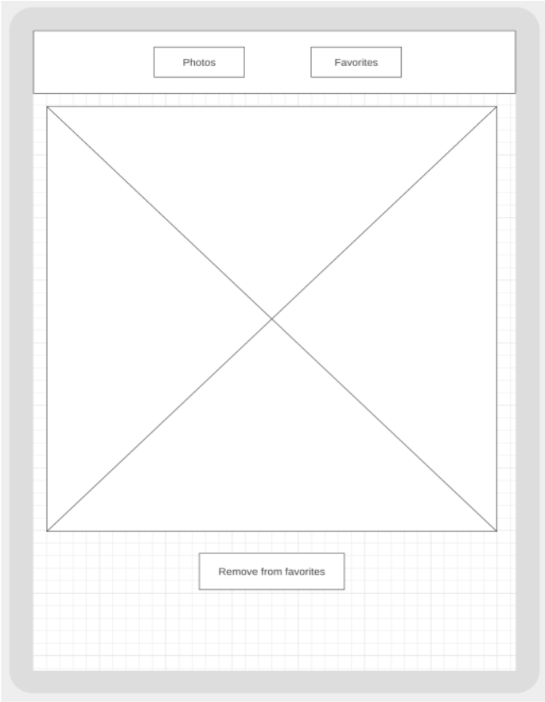

- [Photo Gallery Angular App](#photo-gallery-angular-app)
  - [Requirements](#requirements)
    - [Photos screen has an infinite scrollable list of photos](#photos-screen-has-an-infinite-scrollable-list-of-photos)
    - [Header](#header)
    - [Favorites screen](#favorites-screen)
    - [Single photo page](#single-photo-page)
    - [UI Mocks](#ui-mocks)
  - [User Story Breakdown](#user-story-breakdown)
    - [Story Priority](#story-priority)
      - [UI: Create Project (User Portal)](#ui-create-project-user-portal)
      - [UI: Photos random screen with an infinite scrollable list of photos](#ui-photos-random-screen-with-an-infinite-scrollable-list-of-photos)
      - [UI: App Header](#ui-app-header)
      - [UI: Favorites screen](#ui-favorites-screen)
      - [UI: Single photo page view](#ui-single-photo-page-view)
  - [List of Test Cases (template)](#list-of-test-cases-template)
  - [App Specs](#app-specs)

# Photo Gallery Angular App

Minimal photo gallery angular application. Create a photo library that includes an infinite random photo stream, with the ability
to save photos to your “Favorites” library

## Requirements

### Photos screen has an infinite scrollable list of photos

- Located at / path.
- Clicking a photo adds it to Favorites.
- When scrolling, new photos should be loaded. Loader icon should be
  displayed.
- Use https://picsum.photos/200/300 to get random images (or any other
  resource).
- Emulate real-world API, when getting photos. Loading new photos
  should have a random delay of 200-300ms

### Header

- Consists of 2 buttons and allows you to switch between your “Favorites” library and a random photo stream.
- An active view must be highlighted

### Favorites screen

- Located at /favorites path.
- Contains a list of favorite photos (no need for infinite scrolling here, just
  list of all photos).
- Clicking on a photo opens a single photo page.
- Favorites list should persist after a page refresh
  - session storage or local storage

### Single photo page

- Located at /photos/:id path.
- Shows just a single full-screen photo, instead of a grid.
- Should contain the “Remove from favorites” button.
- The header remains the same on this page.

### UI Mocks

## User Story Breakdown

### Story Priority

1. UI: Create Project (User Portal)
   1. Set up routing, angular material and scss
2. UI: Photos random screen with an infinite scrollable list of photos
3. UI: App Header
4. UI: Favorites screen
5. UI: Single photo page view

#### UI: Create Project (User Portal)

Must have

- **DONE** Create project
  - ng new photo-gallery --style=scss --routing=true
- **DONE** routing
  - Created app with routing
  - need to add routing for
    - Add fall back page redirect root page (random list of images) or to 404 (stretch)
  - Add lazy loading (stretch)
- **DONE** angular material (deep purple/amber theme)
- **DONE** scss
- angular http client
- **DONE** create version file (use semantic versioning)
- **DONE** unit tests:

| Case No | Description                    | Expected Result |
| ------- | ------------------------------ | --------------- |
| 1       | should create the appComponent | true            |

#### UI: Photos random screen with an infinite scrollable list of photos

Must have

- unit tests (to be defined)
- on load, load images
- infinite scroll down
  - When scrolling, new photos should be loaded. Loader icon should be displayed.
- load images from (https://picsum.photos/200/300)
- implement onPush strategy
- be located at '/' root
- http requests are delayed by 250ms
- Clicking a photo adds it to Favorites. Also add the heart badge here to indicate it
- Use https://picsum.photos/200/300 to get random images (or any other
  resource).
- Emulate real-world API, when getting photos. Loading new photos
  should have a random delay of 200-300ms

#### UI: App Header

Must have

- unit tests (to be defined)
- on change show loader
- Consists of 2 buttons and allows you to switch between your “Favorites” library and a random photo stream.
- An active view must be highlighted

#### UI: Favorites screen

Must have

- unit tests (to be defined)
- Located at /favorites path.
- Contains a list of favorite photos (no need for infinite scrolling here, just
  list of all photos).
- Clicking on a photo opens a single photo page.
- Favorites list should persist after a page refresh
  - session storage or local storage

#### UI: Single photo page view

Must have

- unit tests (to be defined)
- Located at /photos/:id path.
- Shows just a single full-screen photo, instead of a grid.
- Should contain the “Remove from favorites” button.
- The header remains the same on this page.

## List of Test Cases (template)

| Case No | Description | Expected Result |
| ------- | ----------- | --------------- |
|         |             |                 |

## App Specs

1. Use Angular Router module
2. Use the latest Angular, and SCSS instead of CSS
3. Use Angular Material components
4. Implement the infinitive scroll on your own. Do not use libraries.
5. Don’t use any backend server for retaining state
6. Add unit tests
7. Think carefully about how to structure your code. Make separate reusable components, modules, etc Test your code
8. Use async pipe and RxJS do not use subscriptions and promises
9. Implement Change Detection on Push To improve Performance (stretch)
